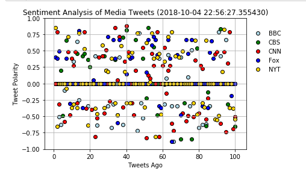

# News Media Tweets Sentiment Analysis 

Using a Jupyter Notebook, this program will perform a Vader Sentimenet Analysis on the 100 most recent tweets from a list of target user accounts.

This notebook specifically queries the most recent tweets from: BBC, CBS, CNN, FOX, and the NY Times.
This notebook can easily be modified to search for 'any' tweet accounts by modifying the list of Search_Terms in the 3rd cell.
You must import your own Twitter API Keys for the tweepy API to work.

For more information on Vader Sentiment Analysis, you can visit: https://github.com/cjhutto/vaderSentiment.

"Vader (Valence, Aware Dictionary and sEntiment Reasoner) is a lexicon and rule-based sentiment analysis tool that is specifically attuned to sentiments expressed in social media, and works well on texts from other domains" (summary from MIT github page).

The Sentiment Analysis is then visualized using matplotlib.

